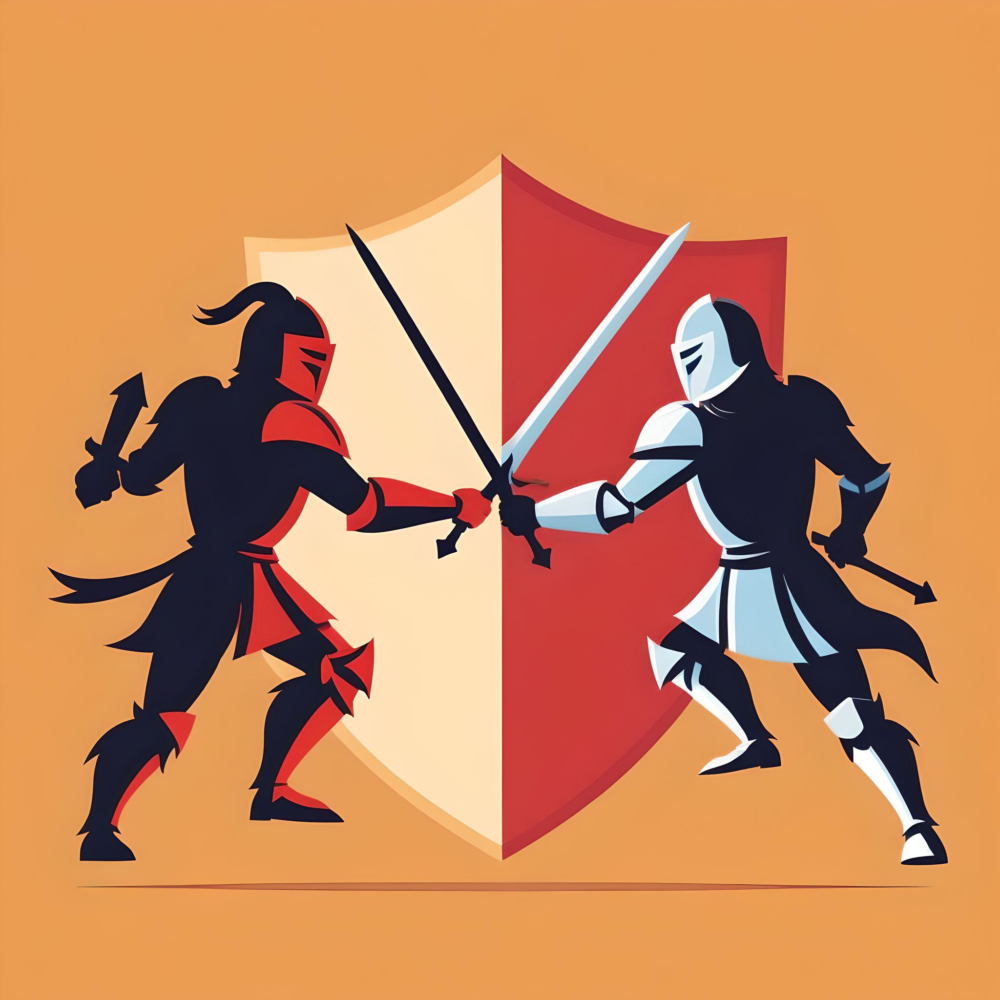

# ABYSS BATTLE

En este repositorio se lleva un registro de las actividades necesarias para el desarrollo de este proyecto para la materia de Programación Estructurada. Les compartimos la información relacionada:

### "Facultad de Matemáticas"
#### Grupo D - EMILIO GABRIEL REJÓN HERRERA

## Mastro encargado
 - Emilio Gabriel Rejón Herrera

## Miembros del equipo
 - Alonzo Palacios Rodrigo
 - Cuevas García Braulio Samuel
 - Moo Pan Jareth Jaziel
 - Martínez Martínez José Pablo

---
## Documentación:
### [Primera Entrega - Propuesta del proyecto](https://github.com/JarethJaziel/Abyss_Battle/tree/PrimeraEntrega)
### [Segunda Entrega - Propuesta del proyecto](https://github.com/JarethJaziel/Abyss_Battle/tree/SegundaEntrega)
### [Entrega Final - Propuesta del proyecto](https://github.com/JarethJaziel/Abyss_Battle/tree/TerceraEntrega)

